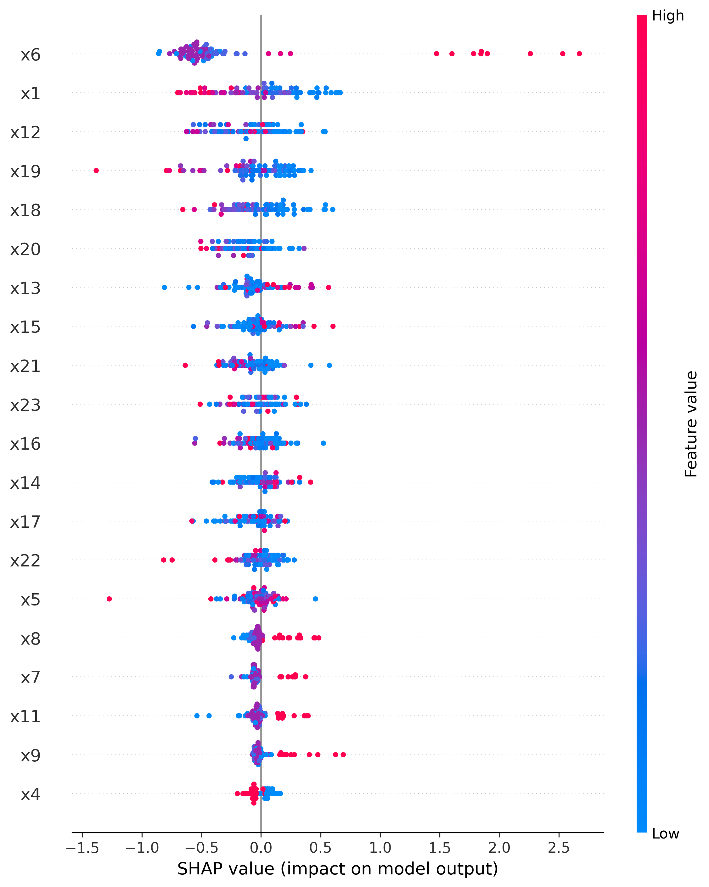
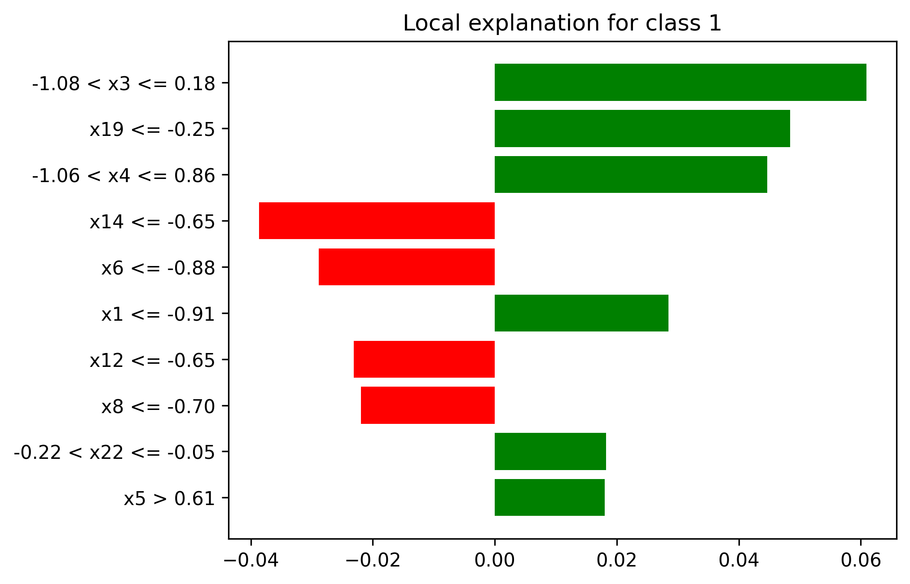
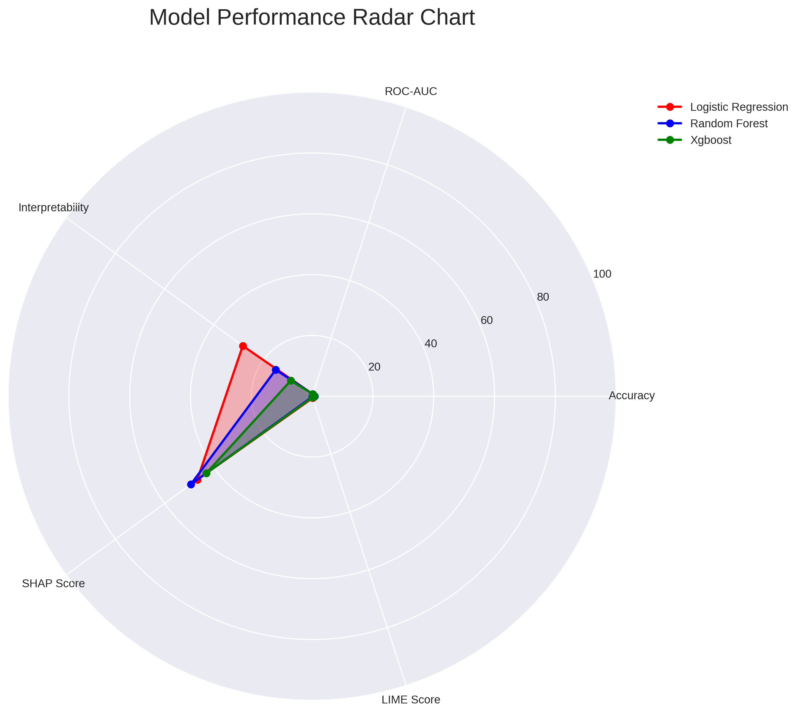

# Explainable AI (XAI) Framework for Credit Risk Prediction


A comprehensive Explainable AI (XAI) framework for credit risk prediction that compares model accuracy and interpretability in high-stakes financial decision systems. This project implements a pipeline that trains multiple machine learning models and explains their predictions using SHAP and LIME.

## 🎯 Project Overview

This project implements and compares three machine learning models for credit risk prediction, applying modern Explainable AI techniques to make predictions transparent and auditable.

### Key Features
* 📊 **Multiple ML Models**: Logistic Regression, Random Forest, and XGBoost.
* 🔍 **Dual XAI Approach**: SHAP (global + local feature impact) and LIME (instance-level explanations).
* 📈 **Analysis**: Systematic Accuracy vs. Interpretability trade-off analysis.
* 🎨 **Rich Visualizations**: Automated visualization outputs for model insights.
* ⚖️ **Ethical AI Focus**: Emphasis on transparency, fairness, and auditability.
* 🧩 **Modular Design**: Structured pipeline from data loading to evaluation.

## 🚀 Quick Start

### Installation & Execution
```bash
# Clone the repository
git clone https://github.com/your-username/xai-credit-risk.git
cd xai-credit-risk

# Install requirements
pip install -r requirements.txt

# Run the complete pipeline
python main.py
``` 

### Requirements
* **Python 3.10+** 
* `pandas`, `numpy`, `scikit-learn`, `xgboost`, `shap`, `lime`, `matplotlib`, `seaborn` 

## 📁 Project Structure

```text
xai_credit_risk/
├── src/                    # Source code
│   ├── data_loader.py      # Data loading and exploration
│   ├── preprocessor.py     # Data preprocessing pipeline
│   ├── quick_train.py      # Model training
│   ├── shap_explainer.py   # SHAP explanations
│   ├── lime_explainer.py   # LIME explanations
│   └── analysis.py         # Comparative analysis
├── data/                   # Processed data
├── models/                 # Trained models
├── results/                # Results and explanations
├── figures/                # Visualizations and plots
├── technical_report.md     # Comprehensive technical report
└── README.md               # This file
```

## 🏗️ Methodology

### 1. Data Pipeline
* **Dataset**: UCI Credit Card Default Dataset (~30k samples).
* **Source**: Automatically downloaded via OpenML.
* **Steps**: Includes data loading, exploration, preprocessing, and scaling.

### 2. Machine Learning Models
| Model | Type | Strength |
| :--- | :--- | :--- |
| **Logistic Regression** | Linear | High interpretability  |
| **Random Forest** | Ensemble | Strong accuracy  |
| **XGBoost** | Gradient Boosting | High performance  |

### 3. XAI Techniques
* **SHAP**: Provides both global and local feature impact analysis.
* **LIME**: Provides granular instance-level explanations.

## 📊 Outputs Generated
The pipeline generates the following assets in the `results/` and `figures/` directories:
* Trained Machine Learning Models.
* SHAP & LIME explanation plots.
* Accuracy vs. Interpretability comparison reports.
* Automated visualization figures.

## 📋 Ethical Considerations
This framework is built with a focus on responsible AI for financial systems:
* **Transparency**: Making "black-box" models understandable.
* **Fairness**: Ensuring equitable credit risk assessment.
* **Auditability**: Providing clear trails for decision-making.

---
**Note**: This project was created for **Data Science & AI Masters applications** and ML portfolio demonstration.

## 📄 License
This project is licensed under the **MIT License**.


## 📸 Sample Outputs

### SHAP Feature Importance


### LIME Explanation


### Model Comparison Radar

